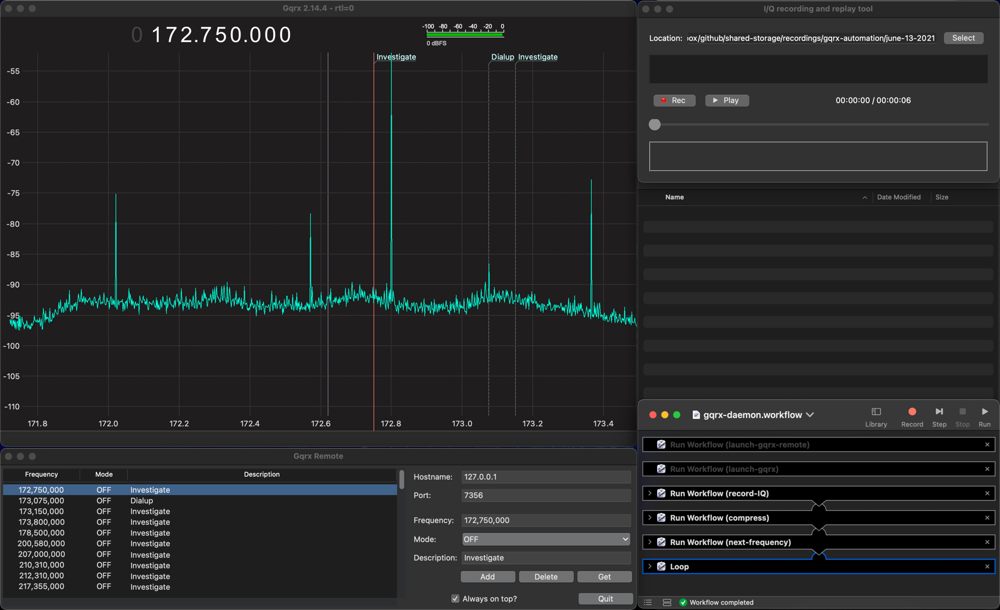

# gqrx-mac-osx-automation

Video Demonstration: https://www.youtube.com/watch?v=dWIt9EqDnPY

## Installation & Instructions

Download Gqrx: https://github.com/csete/gqrx/releases/download/v2.14.4/Gqrx-2.14.4.dmg

bookmarks.csv are normally stored in a hidden folder: `~/.config/gqrx`


**gqrx** generates a file with bookmark data with the following format:
```
# Tag name          ;  color
Todo: Record IQ     ; #00ffd9
AM Radio            ; #5be7ff
Investigate         ; #fc0017
FM Radio            ; #70c5ff
# Frequency ; Name                     ; Modulation          ;  Bandwidth; Tags
    13000000; Investigate              ; Demod Off           ;      10000; Recheck Result: Off
    26500000; Investigate              ; Demod Off           ;          0; Untagged
    27000000; FM                       ; WFM (stereo)        ;     160000; FM Radio
```

**gqrx-remote** reads a format like:
```
97400000,WFM_ST,Radio
124150000,AM,Weather
137500000,FM,NOAA
```

So you will have to update your format to be like the one gqrx-remote reads.

Some regex that might speed things up:
\s\s+;.* -> replace with empty
; -> replace with ,OFF,


IQ files from GQRX can get extremely huge very fast but luckily, the command line utility `compress` will reduce them by a factor of 10.
This allows you to save raw IQ files for further processing later without taking up too much harddrive space and making uploading to cloud services much faster.

I have also included a decompress binary or you can just type `compress -d <filename>` instead.


## To Start

Open terminal in the this folder and type

```shell
Gqrx-remote
```

Double click on Gqrx.app and Gqrx-automation.

In Gqrx.app open IQ recorder through the menus or just press CMD+I

Position the windows like so:



Click on Gqrx and press CMD+D to start displaying data.

Click on the Run button in Automator and it will automatically go through your bookmarks and record them as per your settings.

**Notes:**

Open the other automation workflows that the daemon calls to change the duration of recording and to match up how many cycles with how many signals you want recorded.
